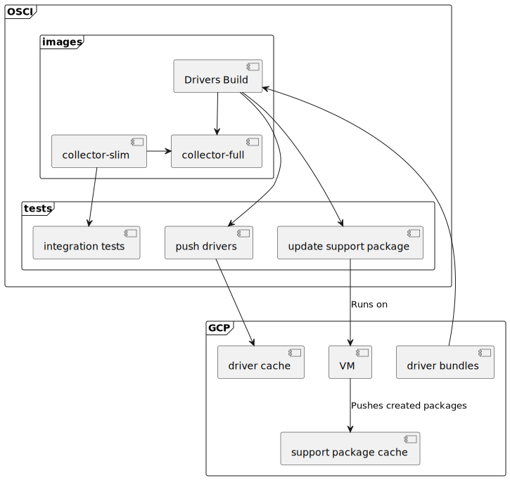
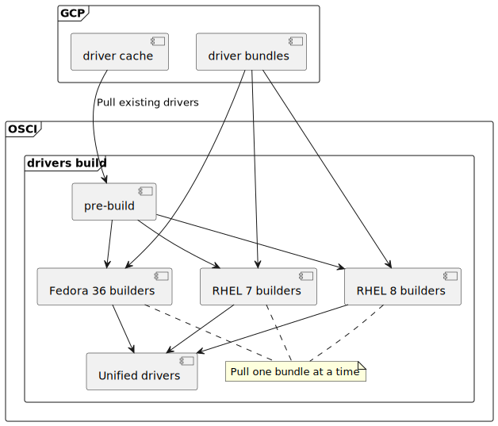
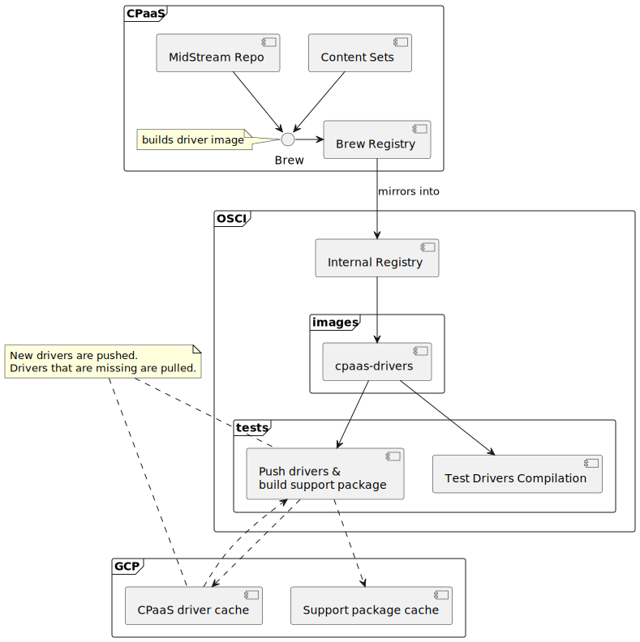

### Upstream drivers flow



<details>
<summary>raw plantuml</summary>

```
@startuml

frame "GCP" {
    component [driver cache] as dcache
    component [driver bundles] as dbundles
    component VM
    component [support package cache] as supacache

    VM -.> supacache: Pushes created packages
}

frame OSCI {
    frame images {
        component [Drivers Build] as dbuild

        dbundles ..> dbuild
        [collector-slim] -> [collector-full]
        dbuild --> [collector-full]
    }

    frame tests {
        component [integration tests] as its
        component [push drivers] as dpush
        component [update support package] as updatesupa

        [collector-full] --> its
        dbuild --> dpush
        dpush ..> dcache
        dcache ..> dbuild
        dbuild --> updatesupa
        updatesupa --> VM : Runs on
    }
}
@enduml
```
</details>


#### Drivers build
This is a more detailed look at the `Drivers Build` component from the previous graph



<details>
<summary>raw plantuml</summary>

```
@startuml

frame "GCP" {
    component [driver cache] as dcache
    component [driver bundles] as dbundles
}

frame OSCI {
    frame "drivers build" {
        component [RHEL 7 builders] as rhel7
        component [RHEL 8 builders] as rhel8
        component [Fedora 36 builders] as fc36
        component [Unified drivers] as unified

        note as pullnote
            Pull one bundle at a time
        end note

        dcache -.> [pre-build] : Pull existing drivers
        [pre-build] --> rhel7
        [pre-build] --> rhel8
        [pre-build] --> fc36
        dbundles ..> rhel7
        dbundles ..> rhel8
        dbundles ..> fc36
        rhel7 --> unified
        rhel8 --> unified
        fc36 --> unified

        rhel7 .. pullnote
        rhel8 .. pullnote
        fc36 .. pullnote
    }
}
@enduml
```
</details>

> Notes:
>
> - The collector repo holds the full list of kernels to be built
> - The pre-build stage is responsible for splitting tasks among driver builders

### CPaaS drivers flow



<details>
<summary>raw plantuml</summary>

```
@startuml

frame "GCP" {
    component [CPaaS driver cache] as dcache
    component [Support package cache] as supabucket
}

frame "CPaaS" {
    component [Brew Registry] as brewreg

    [Content Sets] --> Brew
    [MidStream Repo] --> Brew
    Brew -> brewreg

    note left of Brew: builds driver image
}

frame "OSCI" {
    component [Internal Registry] as oscireg

    frame images {
        component [cpaas-drivers] as cpaasdrivers
    }

    frame tests {
        component [Push drivers &\nbuild support package] as buildandsupa
        component [Test Drivers Compilation] as dtests
    }

    brewreg --> oscireg: mirrors into
    oscireg --> cpaasdrivers
    cpaasdrivers --> buildandsupa
    dcache ..> buildandsupa
    buildandsupa ..> dcache
    buildandsupa ..> supabucket
    cpaasdrivers --> dtests
}

note as driverpushpull
    New drivers are pushed.
    Drivers that are missing are pulled.
end note

driverpushpull .. buildandsupa
driverpushpull .. dcache
@enduml
```
</details>
