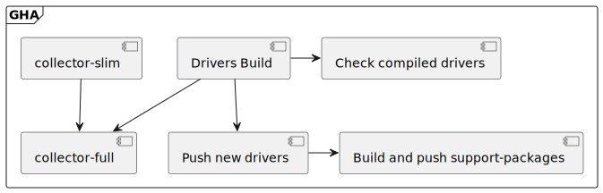

### Upstream drivers flow
The jobs involved in building drivers and how they relate to each other looks
a bit like this:



<details>
<summary>raw plantuml</summary>

```
@startuml

frame GHA {
    component [Drivers Build] as dbuild
    component [Build and push support-packages] as buildsupa
    component [Push new drivers] as push

    [collector-slim] --> [collector-full]
    dbuild --> [collector-full]

    dbuild -> [Check compiled drivers]
    dbuild --> push
    push -> buildsupa
}

@enduml

```
</details>

In order to build the required drivers, the `Drivers build` step will pull
kernel bundles from GCP. The bundles are tarballs containing the required
headers for each kernel version supported, these are created by our
[crawler](https://github.com/stackrox/kernel-packer).

Once building the drivers is done, 3 follow up steps will be triggered:
- Check the log files containing compilation errors.
- Push the built drivers to a GCP bucket.
- Build support-packages with the newly built drivers and push them to GCP.

#### Drivers build
This is a more detailed look at the `Drivers Build` component from the previous graph


<details>
<summary>raw plantuml</summary>

```
@startuml

(*) --> "Prepare sources"
--> "Create a mock cache of drivers"
--> "Get the list of drivers to build"
--> "Figure out how many builders to run"
--> "Split kernels among the builders"
--> "Build needed builders and run them in parallel"
--> "Store built drivers and failures as artifacts"
--> (*)

@enduml

```
</details>

Some things worth of notice:
- The "mock cache" is generated by listing the drivers that are already built
  and uploaded to GCP, then creating empty files that represent them. This is
  done this way since it is much cheaper than actually downloading the drivers
  and the caching mechanism is built with files in mind.

- The number of parallel builders to run is calculated as 10 kernels for each
  builder, up to 32 builders. We split kernels and not drivers in order to
  prevent downloading the same kernel bundle more than once.

- Built drivers and log files holding the compilation errors are stored as
  artifacts in order to be used by subsequent steps.

### CPaaS drivers flow


<details>
<summary>raw plantuml</summary>

```
@startuml

frame "GCP" {
    component [CPaaS driver cache] as dcache
    component [Support package cache] as supabucket
}

frame "CPaaS" {
    component [Brew Registry] as brewreg

    [Content Sets] --> Brew
    [MidStream Repo] --> Brew
    Brew -> brewreg

    note left of Brew: builds driver image
}

frame "OSCI" {
    component [Internal Registry] as oscireg

    frame images {
        component [cpaas-drivers] as cpaasdrivers
    }

    frame tests {
        component [Push drivers &\nbuild support package] as buildandsupa
        component [Test Drivers Compilation] as dtests
    }

    brewreg --> oscireg: mirrors into
    oscireg --> cpaasdrivers
    cpaasdrivers --> buildandsupa
    dcache ..> buildandsupa
    buildandsupa ..> dcache
    buildandsupa ..> supabucket
    cpaasdrivers --> dtests
}

note as driverpushpull
    New drivers are pushed.
    Drivers that are missing are pulled.
end note

driverpushpull .. buildandsupa
driverpushpull .. dcache
@enduml
```
</details>
