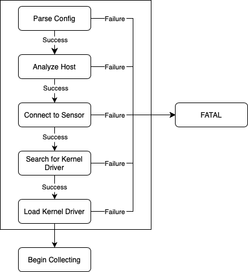

# Collector Troubleshooting

This document describes common error conditions that Collector may encounter, and
provides steps that can be taken to diagnose the cause, fix potential issues and
return Collector to a working state.

If the troubleshooting steps below do not solve the issue, please contact ACS
support.

## First Steps

### Logs

The first thing to look at are the logs from any failing Collectors. The troubleshooting
guides below will offer examples of log messages you can expect to see for a number of
error conditions, so having access to your own logs is invaluable.

Depending on the environment, and accesses, you can get these in a number of ways.

#### Kubectl

Kubernetes is the easiest way to retrieve the logs, provided you have access to
do so. 

```sh
$ kubectl get pods -n stackrox -l app=collector
collector-vclg5                      1/2     CrashLoopBackOff   2 (25s ago)   2m41s

$ kubectl logs -n stackrox collector-vclg5 collector

# sometimes it is also useful to view the previous logs of collector,
# if the current restart is running
$ kubectl logs -n stackrox collector-vclg5 collector --previous
```


#### OC

Since the `oc` tool maintains compatibility with kubectl, the required commands are
much the same.

```sh
$ oc get pods -n stackrox -l app=collector
collector-vclg5                      1/2     CrashLoopBackOff   2 (25s ago)   2m41s

$ oc logs -n stackrox collector-vclg5 collector
$ oc logs -n stackrox collector-vclg5 collector --previous
```

#### Diagnostic Bundle

An alternative method is to download a diagnostic bundle from the ACS UI, by
following the instructions [here](https://docs.openshift.com/acs/configuration/generate-diagnostic-bundle.html)

Within the downloaded bundle, the logs for all Collector pods will be available
for inspection.

### Pod Status

Another way of getting a quick look at the reason for a crashing Collector is to
look at the last state of the Pod. Any failure messages are written to the last
status, and can be viewed using `kubectl` or `oc`:

```sh
# substitute your collector pod into this command
$ kubectl describe pod -n stackrox collector-vclg5
[...]
    Last State:     Terminated
      Reason:       Error
      Message:      No suitable kernel object downloaded
      Exit Code:    1
      Started:      Fri, 21 Oct 2022 11:50:56 +0100
      Finished:     Fri, 21 Oct 2022 11:51:25 +0100
[...]
```

We can instantly see that the Collector has failed to download a kernel driver.

## Collector Start Up

The vast majority of errors occur during Collector startup, where Collector will
configure itself, find or download an appropriate kernel driver for the system,
and then start collecting events. The following diagram describes the main parts
of this start-up process:

<p align="center">
  <!-- To edit the diagram, open with app.diagrams.net -->
  
</p>

If any part of the start-up procedure fails, a helpful diagnostic summary is written
to the logs, detailing which steps succeeded or failed.

For example, for a successful startup, where Collector has been able to connect
to Sensor, download a kernel driver and load the driver successfully into the kernel:

```
[INFO    2022/11/28 13:21:55] == Collector Startup Diagnostics: ==
[INFO    2022/11/28 13:21:55]  Connected to Sensor?       true
[INFO    2022/11/28 13:21:55]  Kernel driver available?   true
[INFO    2022/11/28 13:21:55]  Driver loaded into kernel? true
[INFO    2022/11/28 13:21:55] ====================================
```

## Common Error Conditions

### Unable to Connect to Sensor

The first thing that Collector attempts to do upon starting is connect to Sensor.
Sensor is used to download kernel drivers, and CIDR blocks for processing network
events. As such, it is fundamental to the rest of the start up.

```
Collector Version: 3.12.0
OS: Ubuntu 20.04.4 LTS
Kernel Version: 5.4.0-126-generic
Starting StackRox Collector...
[INFO    2022/10/13 12:20:43] Hostname: 'hostname'
[...]
[INFO    2022/10/13 12:20:43] Sensor configured at address: sensor.stackrox.svc:9998
[INFO    2022/10/13 12:20:43] Attempting to connect to Sensor
[INFO    2022/10/13 12:21:13]
[INFO    2022/10/13 12:21:13] == Collector Startup Diagnostics: ==
[INFO    2022/10/13 12:21:13]  Connected to Sensor?       false
[INFO    2022/10/13 12:21:13]  Kernel driver available?   false
[INFO    2022/10/13 12:21:13]  Driver loaded into kernel? false
[INFO    2022/10/13 12:21:13] ====================================
[INFO    2022/10/13 12:21:13]
[FATAL   2022/10/13 12:21:13] Unable to connect to Sensor.
```

Normally, failing to connect to Sensor either means that Sensor has not started
correctly or Collector has been misconfigured. Double check the Collector configuration
to ensure that the Sensor address is correct, and check that the Sensor pod is running
correctly.

### No Kernel Driver Available

Collector will check whether it has available a kernel driver for the kernel version
of the node. First it checks local storage for a driver of the right version and type
and then, attempts to download one from Sensor. If there is no local kernel driver, 
and Sensor does not provide one, Collector is unable to run and will enter CrashLoopBackOff.

```
Collector Version: 3.12.0
OS: Alpine Linux v3.14
Kernel Version: 5.10.109-0-virt
Starting StackRox Collector...
[INFO    2022/10/13 13:32:57] Hostname: 'alpine'
[...]
[INFO    2022/10/13 13:32:57] Sensor configured at address: sensor.stackrox.svc:9999
[INFO    2022/10/13 13:32:57] Attempting to connect to Sensor
[INFO    2022/10/13 13:32:57] Successfully connected to Sensor.
[INFO    2022/10/13 13:32:57] Module version: 2.2.0
[INFO    2022/10/13 13:32:57] Attempting to find kernel module - Candidate kernel versions:
[INFO    2022/10/13 13:32:57] 5.10.109-0-virt
[INFO    2022/10/13 13:32:57] Local storage does not contain collector-5.10.109-0-virt.ko
[...]
[INFO    2022/10/13 13:32:57] Attempting to download kernel object from https://sensor.stackrox.svc/kernel-objects/2.2.0/collector-5.10.109-0-virt.ko.gz
[WARNING 2022/10/13 13:32:58] [Throttled] Unexpected HTTP request failure (HTTP 404)
[WARNING 2022/10/13 13:33:08] [Throttled] Unexpected HTTP request failure (HTTP 404)
[WARNING 2022/10/13 13:33:18] [Throttled] Unexpected HTTP request failure (HTTP 404)
[WARNING 2022/10/13 13:33:29] [Throttled] Unexpected HTTP request failure (HTTP 404)
[WARNING 2022/10/13 13:33:35] Attempted to download collector-5.10.109-0-virt.ko.gz 30 time(s)
[WARNING 2022/10/13 13:33:35] Failed to download from collector-5.10.109-0-virt.ko.gz
[WARNING 2022/10/13 13:33:35] Unable to download kernel object collector-5.10.109-0-virt.ko to /module/collector.ko.gz
[ERROR   2022/10/13 13:33:35] Error getting kernel object: collector-5.10.109-0-virt.ko
[INFO    2022/10/13 13:33:35]
[INFO    2022/10/13 13:33:35] == Collector Startup Diagnostics: ==
[INFO    2022/10/13 13:33:35]  Connected to Sensor?       true
[INFO    2022/10/13 13:33:35]  Kernel driver available?   false
[INFO    2022/10/13 13:33:35]  Driver loaded into kernel? false
[INFO    2022/10/13 13:33:35] ====================================
[INFO    2022/10/13 13:33:35]
[FATAL   2022/10/13 13:33:35]  No suitable kernel object downloaded for kernel 5.10.109-0-virt
```

The logs will first show the attempts at finding the module locally, and then 
any attempts at downloading the driver from Sensor. The 404 errors above indicate
that there is no kernel driver for the node's kernel. 

All supported kernel versions are listed in the [KERNEL_VERSIONS](../kernel-modules/KERNEL_VERSIONS) file.

### Failed to load the Kernel Driver

In rare cases, there may be a problem with loading the kernel driver. This is the
final step before Collector is fully up and running, and failures can result in a
variety of error messages or exceptions. The same diagnostic summary is reported
in the logs, and will indicate the failure of this step.

If an error of this kind is encountered, it is unlikely that it can be easily 
fixed, so should be reported to ACS support or in a [GitHub issue](https://github.com/stackrox/collector/issues).

The following is a simple example of this occurring:

```
[INFO    2022/10/13 14:25:13] Hostname: 'hostname'
[...]
[INFO    2022/10/13 14:25:13] Successfully downloaded and decompressed /module/collector.ko
[INFO    2022/10/13 14:25:13]
[INFO    2022/10/13 14:25:13] This product uses kernel module and ebpf subcomponents licensed under the GNU
[INFO    2022/10/13 14:25:13] GENERAL PURPOSE LICENSE Version 2 outlined in the /kernel-modules/LICENSE file.
[INFO    2022/10/13 14:25:13] Source code for the kernel module and ebpf subcomponents is available upon
[INFO    2022/10/13 14:25:13] request by contacting support@stackrox.com.
[INFO    2022/10/13 14:25:13]
[...]
[INFO    2022/10/13 14:25:13] Inserting kernel module /module/collector.ko with indefinite removal and retry if required.
[ERROR   2022/10/13 14:25:13] Error inserting kernel module: /module/collector.ko: Operation not permitted. Aborting...
[ERROR   2022/10/13 14:25:13] Failed to insert kernel module
[ERROR   2022/10/13 14:25:13] Failed to setup Kernel module
[INFO    2022/10/13 14:25:13]
[INFO    2022/10/13 14:25:13] == Collector Startup Diagnostics: ==
[INFO    2022/10/13 14:25:13]  Connected to Sensor?       true
[INFO    2022/10/13 14:25:13]  Kernel driver available?   true
[INFO    2022/10/13 14:25:13]  Driver loaded into kernel? false
[INFO    2022/10/13 14:25:13] ====================================
[INFO    2022/10/13 14:25:13]
[FATAL   2022/10/13 14:25:13] Failed to initialize collector kernel components.
```

## Troubleshooting using performance counters

The collector publishes some performance counters that can be used to investigate runtime issues.

The runtime values are exposed via the Prometheus endpoint `/metrics` and can be accessed on port 9090.

### CollectorStats timers -> rox_collector_timers

| Name                                             | Description                                                                                                                          |
|--------------------------------------------------|--------------------------------------------------------------------------------------------------------------------------------------|
| net_scrape_read                                  | Time spent iterating over /proc content to retrieve connections and endpoints for each process.                                      |
| net_scrape_update                                | Time spent updating the internal model with information read from /proc (set removed entries as inactive, update activity timestamp) |
| net_fetch_state                                  | Time spent to build a delta message content (connections + endpoints) to send to Sensor                                              |
| net_create_message                               | Time spent to serialize the delta message and store the resulting state for next computation.                                        |
| net_write_message                                | Time spent sending the raw message content.                                                                                          |


### ColletorStats counters -> rox_collector_counters

| Name                                             | Description                                                                                                                          |
|--------------------------------------------------|--------------------------------------------------------------------------------------------------------------------------------------|
| net_conn_updates                                 | Each time a connection object is updated in the model (scrapes, and kernel events).                                                  |
| net_conn_deltas                                  | Number of connection events sent to Sensor.                                                                                          |
| net_conn_inactive                                | Accumulated number of connections destroyed (closed)                                                                                 |
| net_cep_updates                                  | Each time an endpoint object is updated in the model (scrapes only).                                                                 |
| net_cep_deltas                                   | Number of endpoint events sent to Sensor.                                                                                            |
| net_cep_inactive                                 | Accumulated number of endpoints destroyed (closed)                                                                                   |
| net_known_ip_networks                            | Number of known-networks defined.                                                                                                    |
| net_known_public_ips                             | Number of known public addresses defined.                                                                                            |
| process_lineage_counts                           | Every time the lineage info of a process is created (signal emitted)                                                                 |
| process_lineage_total                            | Total number of ancestors reported                                                                                                   |
| process_lineage_sqr_total                        | Sum of squared number of ancestors reported                                                                                          |
| process_lineage_string_total                     | Accumulated size of the lineage process exec file paths                                                                              |
| process_info_hit                                 | Accessing originator process info of an endpoint with data readily available.                                                        |
| process_info_miss                                | Accessing originator process info of an endpoint ends-up waiting for Falco to resolve data.                                          |
| rate_limit_flushing_counts                       | Number of overflows in the rate limiter used to send process signals.                                                                |


### Sysdig stats -> rox_collector_events

| Name                                 | Description                                                                                         |
|--------------------------------------|-----------------------------------------------------------------------------------------------------|
| kernel                               | number of received kernel events (by the probe)                                                     |
| drops                                | number of dropped kernel events                                                                     |
| preemptions                          | Number of preemptions (?)                                                                           |
| filtered[syscall]                    | Number of events after chisel filtering                                                             |
| userspace[syscall]                   | Number of this kind of event before chisel filtering                                                |
| chiselCacheHitsAccept[syscall]       | number of events accepted by the filter cache                                                       |
| chiselCacheHitsReject[syscall]       | number of events rejected by the filter cache                                                       |
| grpcSendFailures                     | (not used?)                                                                                         |
| processSent                          | Process signal sent with success                                                                    |
| processSendFailures                  | Failure upon sending a process signal                                                               |
| processResolutionFailuresByEvt       | Count of invalid process signal events received, then ignored (invalid path or name, or not execve) |
| processResolutionFailuresByTinfo     | Count of invalid process found parsed during initial iteration (existing processes)                 |
| processRateLimitCount                | Count of processes not sent because of the rate limiting.                                           |
| parse_micros[syscall]                | Total time used to retrieve an event of this type from falco                                        |
| process_micros[syscall]              | Total time used to handle/send an event of this type (call the SignalHandler)                       |
